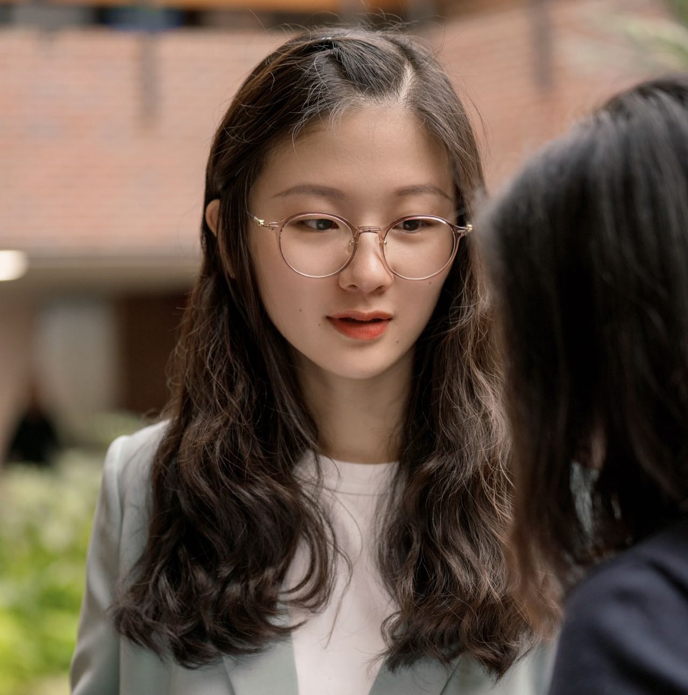

&nbsp;

Inspired and guided by a Blue Sky workshop at the 2023 annual conference of the International Communication Association, where I had the opportunity to moderate a panel on which esteemed scholars like [Autumn Edwards](https://wmich.edu/communication/directory/edwards), [Sun Joo (Grace) Ahn](https://grady.uga.edu/faculty/sun-joo-grace-ahn/), [Tony Liao](https://dot.egr.uh.edu/departments/ilt/people/faculty/liao-tony), [Jih-Hsuan Tammy Lin](https://drtammylin.com/), and [Matthew Lombard](https://klein.temple.edu/directory/matthew-lombard-lombard) shared their invaluable experience of founding and managing research groups and spaces, I began to develop the Presence and Artificial Intelligence (PAI) Lab in July 2023. Echoing the pronunciation and significance of “***π***”, the PAI Lab stands for its commitment to exploring infinite possibilities for non-recurring emerging technology research.

This PAI Lab aims at conducting research on users’ relationships with a range of presence-evoking technologies, including social robots, virtual humans, chatbots, virtual influencers, smartwatches, memes, virtual reality, and augmented reality. The lab also delves into topics such as explainable AI (XAI), Science and Technology Studies (STS), and ubiquitous computing. 

Revolving around both the science and the methods of artificial intelligence, our lab seeks to conduct theoretically robust and methodologically innovative research, with the support of the technologies available in the lab space, including:\
*Aldebaran Robot NAO*\
*Double II Telepresence robot*\
*Meta Quest Pro*\
*UBTech Robot Alpha*\
*Robot Eilik*\
*Shimmer3 GSR+ Unit*\
\
\
Graduate students at the PAI Lab combine technology research with a variety of topics and contexts, including popular culture, globalization, public health, semiotics, and big data. Our lab members are:
 

[Fanjue Liu](https://www.fanjueliu.com/) (graduated Fall 2024)

 

Fanjue Liu was a doctoral student at the University of Florida. Her research investigates how people perceive and interact socially with emerging technologies such as virtual humans. Specifically, she investigates how people use different psychological patterns to interact with virtual influencers, how the emergence of virtual influencers changes the dynamics of influencer marketing, and whether virtual influencers can be considered a viable substitute for human influencers.\

 
 
 
 
 

[Xiaobei Chen](https://www.linkedin.com/in/xiaobei-chen/)
 

Xiaobei Chen is a current PhD/MPH student with concentrations in health communication and epidemiology.  Her research areas include (1) using emerging technologies as interventions for health professionals and patients, (2) examining the association between health technologies and disparities, and (3) exploring public health emergency communication on social media.  In terms of the topics, she focuses on cancer, infectious diseases, and empathic communication in healthcare. \

 
 
 
 
 
[Lynn Jiayue Li](https://www.jou.ufl.edu/staff/jiayue-lynn-li/)
 

Jiayue Lynn Li is a PhD student with a background in media, cultural, and communication studies. Her research interests span digital communication, human-computer/robot interaction, and critical media analysis from a phenomenological standpoint. Her current projects focus on how individuals interact with and make meanings from digital artifacts such as memes created by selfies and (dis)embodied robots, and how this shapes our understanding of the self, others, and the world.\

 
 
 

[Yunxiao Chen (Caitlyn)](https://www.linkedin.com/in/yunxiao-caitlyn-chen-133413178/) (graduated December, 2023; currently Ph.D. student at Boston University)
 
 

Yunxiao Chen (Caitlyn) was a Master’s student and a teaching & research assistant at the College of Journalism and Communications, UF. She defended her thesis in October 2023. She is determined to being a Human-Computer Interaction scholar and user experience expert (design + research). Her future studies will broadly address the intersections of people, information, and technology. Currently, she is researching human attitudes and behaviors with emerging technologies, such as virtual reality and smartwatches. With a background in language and literature, Yunxiao is passionate about creative writing and has published some poems, short stories, and translations in China. As a “Cyberpunk” enthusiast, she aspires to do various art stuff on this theme. She will join the doctoral program in Emerging Media Studies at Boston University. \

 
 
 
 
 

[Loren Ruffin](https://www.linkedin.com/in/loren-ruffin/) (graduated May, 2023)
 

Loren Ruffin was a Professional Master's student in the CJC and completed an M.A. in Mass Communication. Prior to attending UF, she received a B.S. in Communication, with a concentration in Journalism, from East Carolina University. Her study interests included human-machine communication, digital user experiences, and diversity, equity, and inclusion in digital products. As part of her capstone project, she designed and programmed a virtual reality vocabulary game focused on accessibility specifically for deaf and hard-of-hearing users. Post-graduation she is currently a content designer for Uber's Safety UX team, helping to design experiences that aim to keep earners and consumers safe on the app.\

