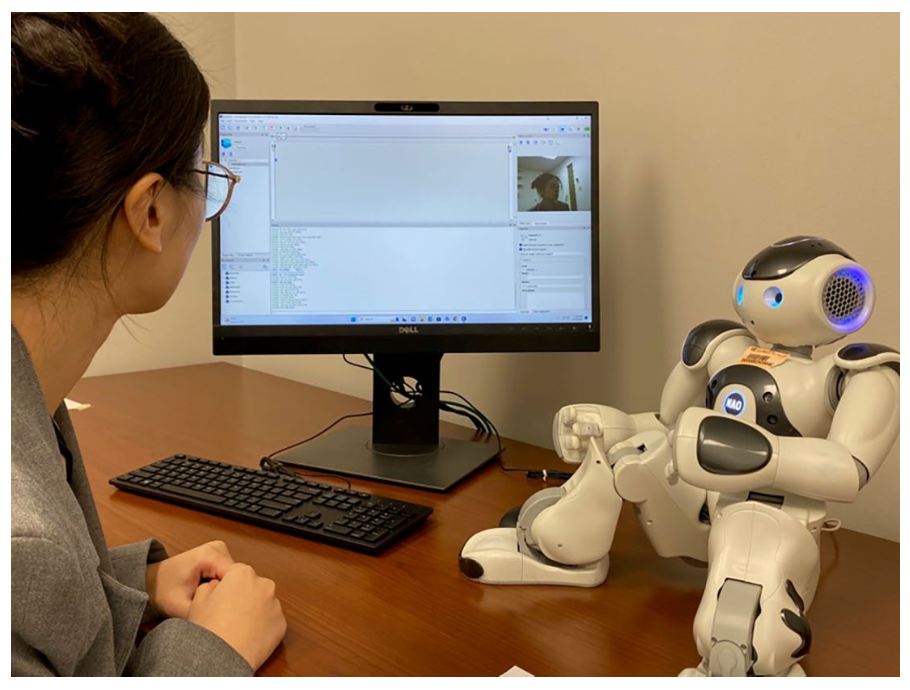
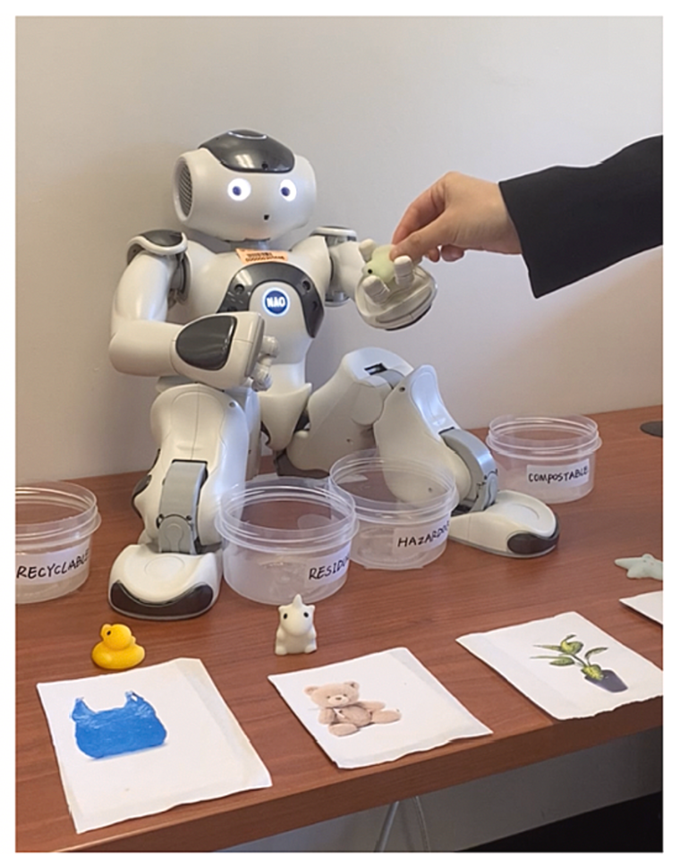
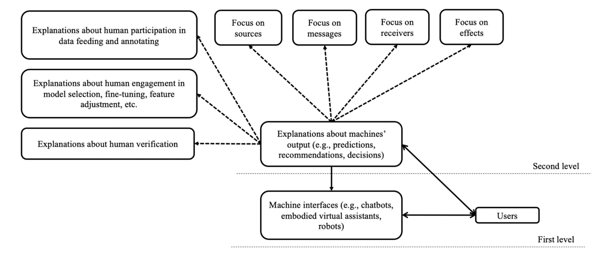

Latest update: 6/1/2025

I identify myself as an HCI scholar who focuses on the roles of social cues and social presence in individuals’ psychological processing of emerging technologies, including humanoid social robots and virtual/augmented agents. To be more specific, my research investigates how and why various combinations of social cues designed into AI-based technologies evoke users’ social responses, including their perceptions of technologies as social entities (i.e., social presence), their trust in technologies, and their compliance with/conformity to technologies. I am also broadly interested in Science and Technology Studies (STS) and seek to understand the mutual shaping between humans and machines.

I was honored and lucky to have been mentored by two great scholars in the areas of presence and virtual/augmented reality: [Dr. Matthew Lombard](https://klein.temple.edu/faculty/matthew-lombard) and [Dr. Tony Liao](https://dot.egr.uh.edu/departments/ilt/people/faculty/liao-tony). 

**My research program subsumes three general directions:**

[1] Testing and extending the Computers are Social Actors (CASA) paradigm to the Media are Social Actors (MASA) paradigm;

[2] Testing and developing a framework that integrates interpersonal communication, human-computer interaction, and computer-mediated communication to better understand AI technologies;

[3] Bridging communication research with explainable AI and understanding how various explanation components affect individuals’ decision-making in human-AI interactions.

 

**[1] Testing and extending the Computers are Social Actors (CASA) paradigm to the Media are Social Actors (MASA) paradigm:**

This first line of my research seeks to update and extend the classic HCI framework, the Computers Are Social Actors (CASA) paradigm. This paradigm has been widely applied to predict how users mindlessly apply some of the social scripts of interpersonal communication to HCI. However, some gaps remain to be filled in past CASA literature: 1) what social cues exert stronger effects than others in evoking users’ social responses, 2) what mechanism best explains users’ psychological responses to technologies, and 3) how “social” a technology can be to bring forth users’ mindless social responses. Therefore, my works extend this paradigm to a more structured and proposition-based framework, the Media Are Social Actors (MASA) paradigm, by distinguishing the effects of single social cues designed into technologies, identifying the application contingencies of mindless anthropomorphism and mindful anthropomorphism as two major explanatory architectures, and drawing on evolutionary psychology to build the foundation for the paradigm. This new theoretical framework lists testable propositions that allow scholars to derive hypotheses and research questions in future AI research. 

<u>Relevant publications:</u>

Lombard, M., & Xu, K. (corresponding author) (2021). Social responses to media technologies: The Media are Social Actors paradigm. *Human-Machine Communication, 2,* 29-55. [PDF](publications/Lombard & Xu 2021 Social Responses to Media Technologies in the 21st Century_ The M.pdf)

Xu, K. (2019). First encounter with robot Alpha: How individual differences interact with vocal and kinetic cues in users’ social responses. *New Media & Society, 21,* 2522-2547. [PDF](publications/Xu 2019 Robot alpha.pdf)

Xu, K. (2020). Language, modality, and mobile media use experiences: Social responses to smartphone cues in a task-oriented context. *Telematics and Informatics, 48,* 101344 [PDF](publications/Xu 2020 Mobile phone study.pdf)

Xu, K., Chen, M., & You, L. (2023). The hitchhiker's guide to a credible and socially present robot: Two meta-analyses of the power of social cues in human-robot interaction. *International Journal of Social Robotics.*  [PDF](publications/Xu et al. 2023 Meta-Analyses.pdf)

Xu, K., Chen, X., & Huang, L. (2022). Deep mind in social responses to technologies: A new approach to explaining the Computers are Social Actors phenomena. *Computers in Human Behavior, 134,* 107321. [PDF](publications/Xu et al. 2022 Deep mind in social responses.pdf)

 

**[2] Testing and developing a framework that integrates interpersonal communication, HCI, and computer-mediated communication (CMC):**

While the development of the MASA paradigm focuses on the effects of human social cues (e.g., human appearances, human voices, gestures) designed into technologies, the second line of my research develops a theoretical framework that explicates different types of cues presented by emerging technologies. For example, users may interact with a telepresence robot through cues presented by both the technology per se (e.g., robotic movements) and the remote human user (e.g., facial expressions). Virtual/augmented reality (VR/AR) technologies allow users to interact with the verbal and non-verbal cues of virtual agents within the immersive/augmented environments as well as the force and touch feedback cues delivered by the controllers. Although chatbots use human language, they vary in response delays and the use of emojis, memes, message receipts, and other CMC components. Given that these telepresence robots, VR/AR technologies, and chatbots have blurred the traditional boundaries of HCI and CMC, and hence challenged the existing conceptualizations of mediation, intelligence, and reality, this line of research pursues the integration of core concepts/theories across the fields of HCI, interpersonal communication, and CMC. In a special issue examining the future state of CMC, my research proposed a typology of cues (i.e., cues as social signals, message elements, social categories, affordances) to better understand future human-technology relationships. This typology seeks to bridge theories from different fields to understand convergent technologies that deliver both human social cues and machine-generated social cues at the same time. 
 

<u>Relevant publications:</u>

Xu, K., & Liao, T. (2020). Explicating cues: A typology for understanding emerging media technologies. *Journal of Computer-Mediated Communication, 25,* 32-43. [PDF](publications/Xu & Liao Explicating Cues JCMC.pdf); [Long Version](publications/ICA paper 5.30 Kun & Tony.pdf) 

Xu, K., Chen, X., Liu, F., & Huang, L. (2024). What did you hear and what did you see? Understanding the transparency of facial recognition and speech recognition systems during human-robot interaction. *New Media & Society.* Online First. [PDF](publications/xu-et-al-2024-what-did-you-hear-and-what-did-you-see-understanding-the-transparency-of-facial-recognition-and-speech.pdf) 

Xu, K., & Lombard, M. (2017). Persuasive computing: Feeling peer pressure from multiple computer agents. *Computers in Human Behavior, 74,* 152-162. [PDF](publications/Xu_Lombard_Persuasive computing.pdf)

Xu, K. (2023). A mini imitation game: How individuals model social robots via behavioral outcomes and social roles. *Telematics & Informatics, 78,* 101950. [PDF](publications/Xu 2023 mini imitation game.pdf)

 

**[3] Bridging communication research with explainable AI and understanding how various explanation components affect individuals’ decision-making in human-AI interactions:**

The third line concentrates on XAI and examines how various forms of explanations about algorithms may affect users’ attitudes toward AI-made decisions. Given that AI-based technologies are becoming more automatic, multi-layered, and ubiquitous, explanations of the working mechanisms of these technologies, especially concerning the role of human intervention and human verification in the algorithms of these technologies, will be pivotal in fostering our theorization of AI. This line of work will provide insights into how individuals may engage in a two-level communication process, where the content and the forms of the explanations of AI systems will serve as an additional meaning-making process and merge with the first-level meaning-making between humans and AI systems. Building on my prior work on cues and human-centered AI, I anticipate that these two lines of research will continue to inform areas such as user interface design, education, health intervention, teleconferencing, as well as shed light on the philosophical and methodological discussions about human-technology relationships. 

&nbsp;

<u>Relevant publications:</u>

Xu, K., & Shi, J. (2024). Visioning a two-level human-machine communication framework: Initiating conversations between explainable AI and communication. *Communication Theory, 34,* 216-229. [PDF](publications/Xu & Shi 2024 XAI & communication.pdf)
