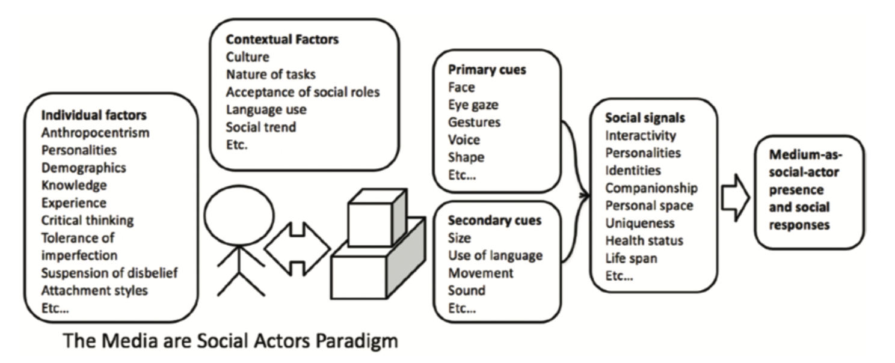
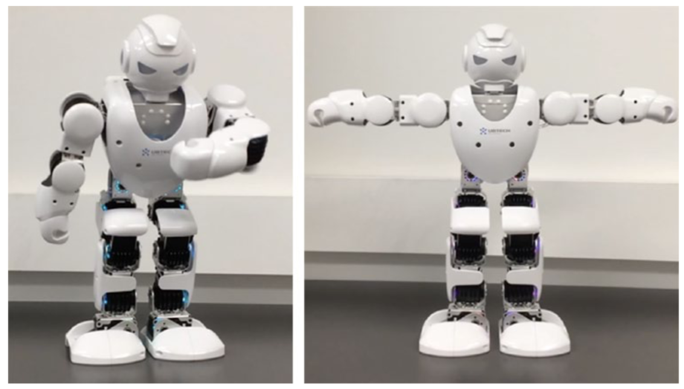
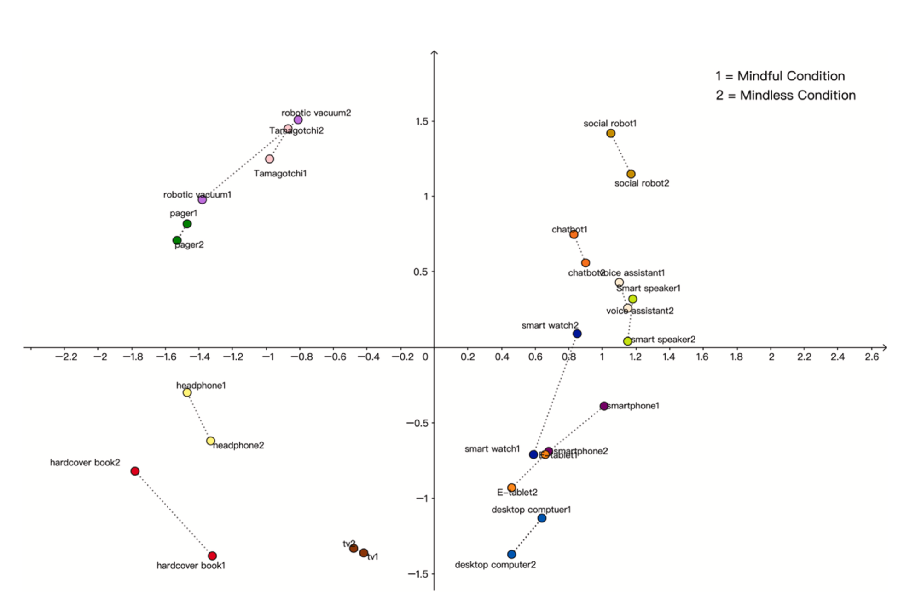
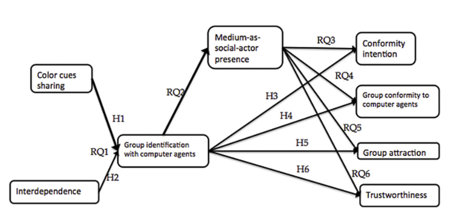
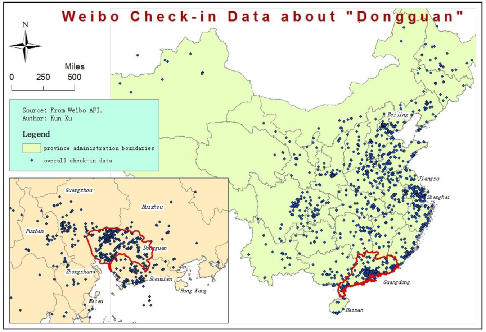
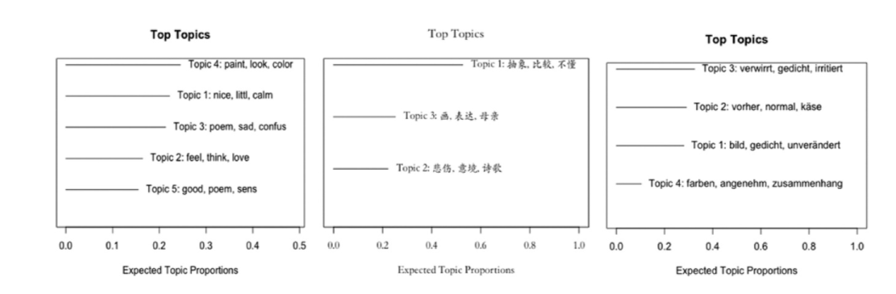
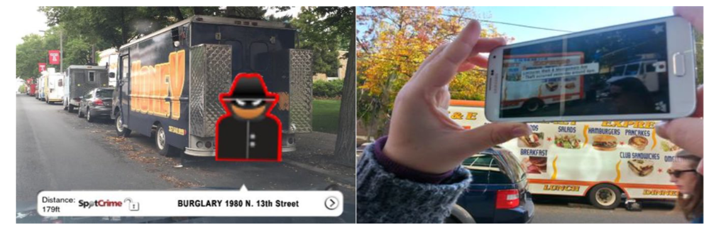

&nbsp;
&nbsp;

Latest update: 6/24/2022

I identify myself as an HCI scholar who focuses on the roles of social cues and social presence in individuals’ psychological processing of emerging technologies, including humanoid social robots and virtual/augmented agents. To be more specific, my research investigates how and why various combinations of social cues designed into machines evoke users’ social responses, including their perceptions of machines as social entities (i.e., social presence), their trust in technologies, and their compliance with/conformity to technologies. I am also broadly interested in Science and Technology Studies (STS) and seek to understand the mutual shaping between humans and machines.

I was honored and lucky to have been advised by two great scholars in the areas of presence and virtual/augmented reality: [Dr. Matthew Lombard](https://klein.temple.edu/faculty/matthew-lombard) and [Dr. Tony Liao](https://www.uhcougarlab.com/aboutus). 

&nbsp;
&nbsp;

**My research program subsumes three general directions:**

[1] Testing and extending the Computers are Social Actors (CASA) paradigm to the Media are Social Actors (MASA) paradigm;

[2] Testing and developing a framework that integrates human-computer interaction and computer-mediated communication to better understand emerging technologies;

[3] Using mixed novel methods to deepen our comprehension of individuals’ emerging technology use phenomena;

&nbsp;
&nbsp;

**[1] Testing and extending the Computers are Social Actors (CASA) paradigm to the Media are Social Actors (MASA) paradigm:**

Clifford Nass and his colleagues proposed the Computers Are Social Actors (CASA) paradigm in the 1990s and found that humans treat computers in some of the ways we treat humans. However, some questions remain to be explored within this paradigm. Dr. Lombard and I proposed the Media are Social Actors paradigm, in which we listed nine testable propositions for future research to test, expounded the effects of social cues on medium-as-social-actor presence (i.e., a type of perceptual experience that allows users to respond to the cues presented by technologies per se), and described the psychological mechanism behind such responses. The major contributions lie in a) our proposal of a hierarchy of social cues that features different quality of social cues in evoking our natural/intuitive responses, b) our attempts to unify two explanatory mechanisms: mindless processing and mindful processing, and c) our explanations of what it means by “social” in social presence and social responses. 

In addition to the theoretical piece, I have conducted several pieces of empirical research to test the framework. For example, I tested how a social robot’s human voice vs. synthetic voice, and their gestural movements vs. non-gestural movements evoked different levels of users’ social presence, trust, and intention of future use. I also looked at how these social responses were moderated by individuals’ attitudes toward social robots and their past robot use experiences. 
 
Similarly, in a task-oriented context, I compared the effects of voice vs. text and anthropomorphic language vs. non-anthropomorphic language on individuals’ conformity to suggestions from a smartphone. And I noticed that such conformity depended upon individuals’ power use of smartphones and daily smartphone use experiences. 
 

Furthermore, my coauthors and I combined multidimensional scaling and the quadratic assignment procedure to understand individuals’ fundamental psychological mechanisms in responding to technologies. We noticed that despite past mixed findings of mindfulness and mindlessness, mindlessness featured greater explanatory power underlying users’ social responses to technologies ranging from robotic vacuum cleaners and hardcover books to social robots and smartwatches. 

&nbsp;

<u>Relevant publications:</u>

Lombard, M., & Xu, K. (corresponding author) (2021). Social responses to media technologies: The Media are Social Actors paradigm. *Human-Machine Communication, 2,* 29-55. [PDF](publications/Lombard & Xu 2021 Social Responses to Media Technologies in the 21st Century_ The M.pdf)

Xu, K. (2019). First encounter with robot Alpha: How individual differences interact with vocal and kinetic cues in users’ social responses. *New Media & Society, 21,* 2522-2547. [PDF](publications/Xu 2019 Robot alpha.pdf)

Xu, K. (2020). Language, modality, and mobile media use experiences: Social responses to smartphone cues in a task-oriented context. *Telematics and Informatics, 48,* 101344 [PDF](publications/Xu 2020 Mobile phone study.pdf)

Xu, K., Chen, X., & Huang, L. (2022). Deep mind in social responses to technologies: A new approach to explaining the Computers are Social Actors phenomena. *Computers in Human Behavior, 134,* 107321. [PDF](publications/Xu et al. 2022 Deep mind in social responses.pdf)

&nbsp;
&nbsp;

**[2] Testing and developing a framework that integrates HCI and computer-mediated communication (CMC):**

If the first line of my research describes how technologies may be designed to be social and “humanlike”, my second line of research probes into how technologies do not necessarily need to be “humanlike” to increase its user experience and enhance our communication effectiveness. A machine can be easily designed with additional visual/kinetic cues to achieve an ideal communication scenario. HCI and CMC are the two fields that have made important contributions to our understanding the role of computers in communication. Therefore, Dr. Liao and I looked into the similarities and differences in these two fields, especially regarding the conceptualizations of cues and social presence, and proposed that scholars may benefit from borrowing the concepts from these two fields and better understand these convergent technologies. 
 

One empirical study that features this line of work was about how individuals may yield to peer pressure from multiple computer agents via even minimal control of visual cues. Combining the Social Identity Model of De-individuation Effects (SIDE) and the Media Equation, we noticed that individuals may succumb to computer agents’ group pressure even if they are aware of the nature of the machines. 

&nbsp;

<u>Relevant publications:</u>

Xu, K., & Liao, T. (2020). Explicating cues: A typology for understanding emerging media technologies. *Journal of Computer-Mediated Communication, 25,* 32-43. [PDF](publications/Xu & Liao Explicating Cues JCMC.pdf); [Long Version](publications/ICA paper 5.30 Kun & Tony.pdf) 

Xu, K., & Lombard, M. (2017). Persuasive computing: Feeling peer pressure from multiple computer agents. *Computers in Human Behavior, 74,* 152-162. [PDF](publications/Xu_Lombard_Persuasive computing.pdf)

&nbsp;
&nbsp;

**[3] Using novel methods to deepen our understanding of emerging technologies:**

The last line of my research focuses on combining traditional social science approaches and novel methods to explore users’ emerging media use phenomena. I am particularly interested in using machines to learn about the real world. 

In the past, I have combined location-based social networks and geographic information system (GIS) to demonstrate WHERE public opinion leaders influence the discussion about a public event in mainland China, and how points of interests guide users’ check-in behavior. I found that the power of locative mobile social networks over space creation can be influenced by users’ access to technologies, socioeconomic environments, social identities, politics, geographic proximity to the event location, and the city infrastructure. 

In another study, my coauthors and I have combined machine learning approaches (e.g., structural topic modeling) and online experiments to investigate how different genres of artworks, intercultural differences, authorship cues influence participants’ aesthetic evaluation of machine-generated works. 

&nbsp;
 

In a study on augmented reality, my coauthors and I used spatial triad and qualitative methods to explain how people read places through the lens of AR, and also how they extrapolate, speculate, and make associations from AR information. 

&nbsp;

<u>Relevant publications:</u>

Xu, K. (2018). Location speaks: Using GIS approach and Weibo check-in data to understand information communication in China. *China Media Research, 14,* 29-43. [PDF](publications/Xu Location speaks.pdf) 

Xu, K., Liu, F., Mou, Y., Zeng, J., & Schafer, M. (2020). Using machine learning to learn machines: A cross-cultural study of users’ responses to machine-generated art works. *Journal of Broadcasting and Electronic Media, 64,* 566-591. [PDF](publications/Xu et al. 2020 Using Machine Learning to Learn Machines A Cross Cultural Study of Users Responses to Machine Generated Artworks.pdf)

Liao, T., Yang, H., Lee, S., Xu, K., & Bennett, S. (2020). Augmented criminality: How people process in-situ augmented reality crime information in relation to space/place. *Mobile Media & Communication, 8,* 360-378. [PDF](publications/liao et al. augmented reality.pdf)

Xu, K., Chan-Olmsted, S., & Liu, F. (2022). Smart speakers require smart management: Two routes from user gratifications to privacy settings. *International Journal of Communication, 16,* 192-214. [PDF](publications/Xu et al. 2022 Smartspeakers.pdf)
